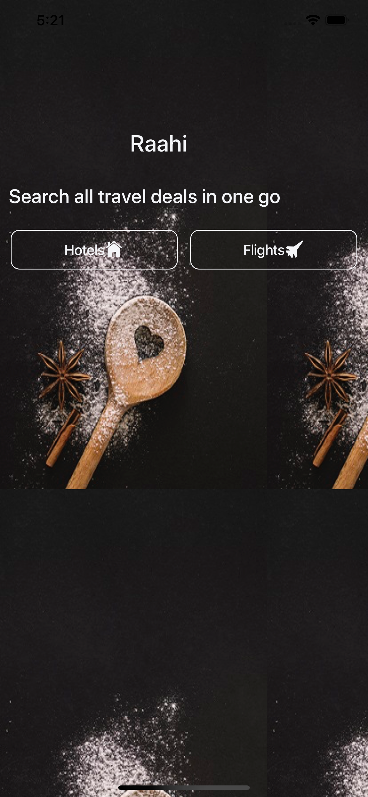
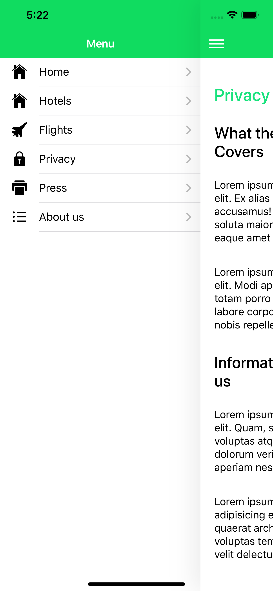
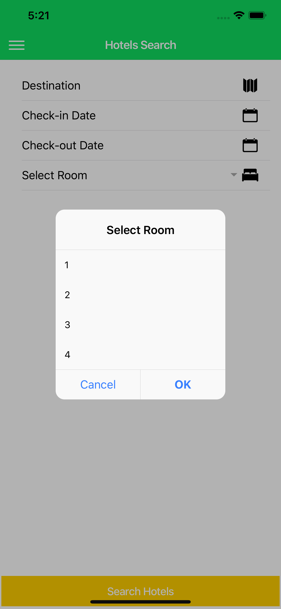
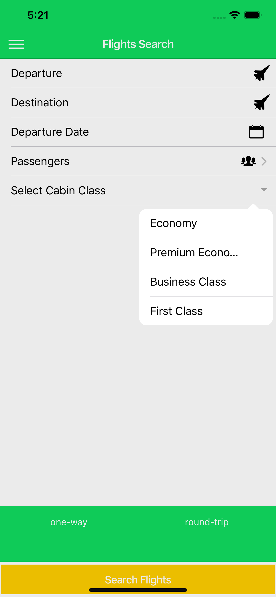
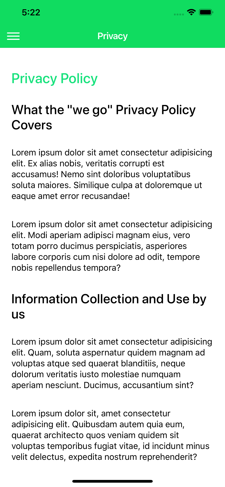
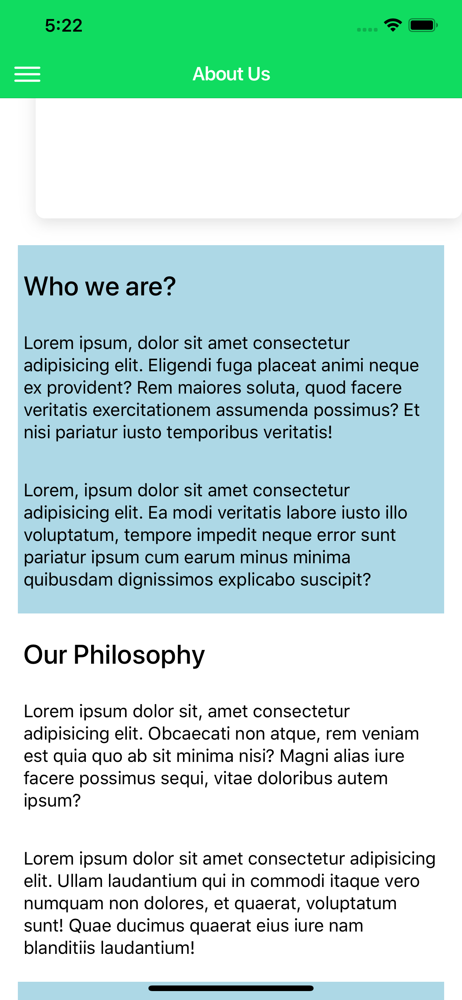

**Project Title** - **Raahi**

 - Ionic app for comparing hotels and flights

we did create quite a good amount of screens covering every aspect of application. Requirement was to create application that can compare flight prices and hotel prices with single app. And within 2–3 weeks we are almost ready with UI part of it.

**Tech/framework used** - Ionic4 
https://ionicframework.com/docs

**Installation**

- Clone or download project

- npm install

- for run in **ionic serve --lab** 

**Some Screenshots of Application**

**Home Page**
<!-- .png ) -->

**Menu**

**Hotel Search Page**

**Flight Search**

**Privacy Page**

**About Page**

